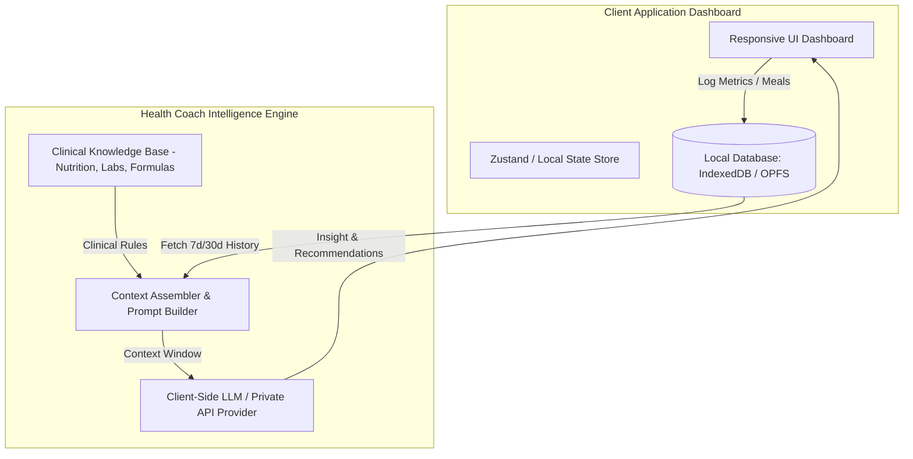
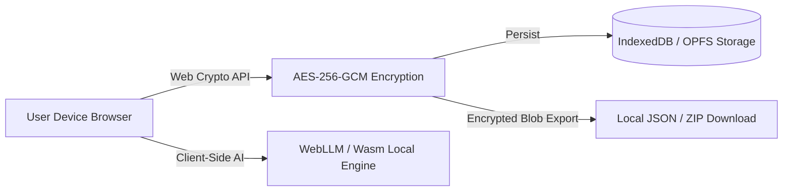

# Technical Architecture Analysis & Web Adaptation Guide: H1an1/health-coach

This report provides an in-depth architectural breakdown of the **`H1an1/health-coach`** repository (an open-source, privacy-first AI agent health coach skill) and details actionable guidelines for adapting its data models, clinical algorithms, and intelligence features into a modern, responsive web application.

---

## 1. Core Architectural Overview

`H1an1/health-coach` operates as a **local-first AI Agent Skill**. Unlike traditional client-server health platforms, its original design decouples data storage and clinical reference knowledge from cloud services:

- **Local Storage Layer (`/health`)**: Contains user profile configs (`config.json`), time-series daily metrics (`weight.csv`, `metrics.json`), and lab marker logs.
- **Clinical Knowledge Engine (`/references`)**: Curated Markdown knowledge bases for BMR/TDEE calculation formulas, blood marker reference ranges, GLP-1 weight-loss medication protocols, and workout heart-rate zones.
- **Automation Pipeline (`/scripts`)**: Shell scripts (`init.sh`, `report.sh`) that aggregate local data, parse external inputs (e.g., Apple Health XML exports), and produce structured summary reports for LLM reasoning.



---

## 2. Data Models & Schemas

To adapt `H1an1/health-coach` for a production web application (TypeScript / Web DB), we translate its markdown and config file formats into strongly typed interfaces and database schemas.

### 2.1 Profile Initialization & Goals Schema
Tracks demographics, baseline biometrics, target metrics, and clinical constraints.

```typescript
export type Gender = 'male' | 'female' | 'other';
export type ActivityLevel = 'sedentary' | 'lightly_active' | 'moderately_active' | 'very_active' | 'extra_active';
export type PrimaryGoal = 'weight_loss' | 'muscle_gain' | 'maintenance' | 'metabolic_health';

export interface UserProfile {
  id: string;
  createdAt: string; // ISO 8601
  updatedAt: string;
  demographics: {
    age: number;
    gender: Gender;
    heightCm: number;
    initialWeightKg: number;
    targetWeightKg: number;
    weeklyWeightLossGoalKg: number; // e.g., 0.5 kg/week
    activityLevel: ActivityLevel;
  };
  clinicalProfile: {
    medicalConditions: string[]; // e.g., ['Hypertension', 'T2D']
    allergies: string[];
    medications: Array<{
      name: string;
      dosage: string;
      frequency: string;
    }>;
    dietaryRestrictions: string[]; // e.g., ['keto', 'vegan', 'low_sodium']
  };
  calculatedTargets: {
    bmr: number; // Mifflin-St Jeor result
    tdee: number;
    targetCalories: number;
    macronutrients: {
      proteinGrams: number;
      carbsGrams: number;
      fatGrams: number;
    };
  };
}
```

### 2.2 Daily Weight & Body Metrics Schema
Stores daily time-series logs along with calculated moving averages and trend direction.

```typescript
export interface DailyBodyMetrics {
  id: string; // YYYY-MM-DD
  date: string; // ISO Date string
  weightKg: number;
  bodyFatPercentage?: number;
  muscleMassKg?: number;
  waistCircumferenceCm?: number;
  visceralFatRating?: number;
  waterPercentage?: number;
  source: 'manual' | 'apple_health' | 'smart_scale';
  // Computed client-side for smooth charting & noise filtering:
  movingAverage7DayKg?: number;
  movingAverage30DayKg?: number;
  weeklyDeltaKg?: number;
}
```

### 2.3 Medical Markers Schema
Supports comprehensive panels (CBC, Metabolic, Lipids, Hormones, Inflammation) with standardized units and reference ranges.

```typescript
export type MarkerCategory = 'lipid' | 'metabolic' | 'cbc' | 'thyroid' | 'hormone' | 'inflammation';
export type MarkerStatus = 'optimal' | 'normal' | 'borderline' | 'critical_low' | 'critical_high';

export interface MedicalMarkerResult {
  id: string;
  testDate: string; // ISO Date
  labName?: string;
  category: MarkerCategory;
  markerKey: string; // e.g., "hba1c", "ldl_c", "hs_crp", "feno"
  markerName: string; // e.g., "Hemoglobin A1c"
  value: number;
  unit: string; // e.g., "%", "mg/dL", "mmol/L"
  referenceRange: {
    min: number;
    max: number;
    optimalMin?: number;
    optimalMax?: number;
  };
  status: MarkerStatus;
  notes?: string;
}
```

---

## 3. Clinical Nutrition Database & Report Generation Engine

### 3.1 Nutrition Database Architecture
`H1an1/health-coach` incorporates a database of over 600 common foods (with detailed macro/micro profiles and density metrics). 

**Web Adaptation Strategy:**
1. **Hybrid Indexing**: Maintain a lightweight SQLite WASM or IndexedDB full-text index (FlexSearch / Fuse.js) locally on the client for instant fuzzy search.
2. **Macronutrient & Micronutrient Mapping**:

```typescript
export interface FoodItem {
  id: string;
  name: string;
  category: string;
  servingSize: number;
  servingUnit: 'g' | 'ml' | 'piece' | 'bowl';
  caloriesPer100g: number;
  macronutrients: {
    protein: number;
    carbohydrates: number;
    fat: number;
    fiber?: number;
  };
  micronutrients?: {
    sodiumMg?: number;
    potassiumMg?: number;
    ironMg?: number;
    calciumMg?: number;
  };
  glycemicIndex?: number;
}
```

### 3.2 Report Generation Engine (`report.sh` Logic Adaptation)
The repository uses periodic reporting scripts to evaluate compliance, spot trajectories, and provide summary insights. In the web application, this is executed by a Web Worker:

1. **7-Day Weight Moving Average Algorithm**: Drops short-term water weight fluctuations using exponential moving averages (EMA) or 7-day simple moving averages (SMA).
2. **Caloric Deficit vs. Weight Delta Validation**: Verifies if expected weight loss ($1\text{ kg fat} \approx 7700\text{ kcal}$) matches logged daily food intake.
3. **Lab Trend Analysis**: Flags markers trending toward critical thresholds over multiple tests.

```typescript
export interface WeeklyReportSummary {
  period: { startDate: string; endDate: string };
  weightMetrics: {
    startWeight: number;
    endWeight: number;
    averageWeight: number;
    netChangeKg: number;
    weeklyTrend: 'losing' | 'gaining' | 'plateau';
  };
  nutritionCompliance: {
    avgDailyCalories: number;
    targetCalorieDiff: number;
    macroAdherenceRatePercentage: number;
  };
  aiCoachInsights: string[];
  actionableRecommendations: string[];
}
```

---

## 4. Privacy-First, Local-First Storage Architecture

Health data requires maximum privacy. `H1an1/health-coach` achieves 100% data privacy by keeping files on the filesystem. For our web app, we mirror this with **Zero-Knowledge Local-First Architecture**.



### 4.1 Storage Layers
1. **Primary Persistence**: IndexedDB via **Dexie.js** or **OPFS (Origin Private File System)** with SQLite WASM for high performance.
2. **Client-Side Encryption**:
   - Web Crypto API (`crypto.subtle`) encrypts sensitive lab markers and notes before saving to IndexedDB using **AES-GCM-256**.
   - Encryption key derived using **PBKDF2** or **Argon2** from a user password/PIN.
3. **Encrypted Backup & Import**:
   - Provide standard encrypted JSON export files (`.healthbackup`) and Apple Health XML import parsing completely inside Web Workers.

---

## 5. Web Application Dashboard & Intelligence Integration

### 5.1 Dynamic Prompt & Context Assembly Engine
To bring AI coach intelligence into the dashboard:
- Construct dynamic context prompts containing user goals, 7-day weight moving averages, nutritional deficits, and recent abnormal lab markers.
- Send this payload either to a **Client-Side LLM (WebLLM / ONNX)** or an **End-to-End Encrypted AI Endpoint**.

```typescript
export function assembleCoachContext(profile: UserProfile, metrics: DailyBodyMetrics[], markers: MedicalMarkerResult[]): string {
  const latest7Days = metrics.slice(-7);
  const abnormalMarkers = markers.filter(m => m.status === 'borderline' || m.status.includes('critical'));

  return `
  [USER PROFILE]
  Gender: ${profile.demographics.gender}, Age: ${profile.demographics.age}, Target: ${profile.demographics.targetWeightKg}kg
  BMR: ${profile.calculatedTargets.bmr} kcal, TDEE: ${profile.calculatedTargets.tdee} kcal

  [7-DAY WEIGHT TREND]
  ${latest7Days.map(m => `${m.date}: ${m.weightKg}kg (7d Avg: ${m.movingAverage7DayKg}kg)`).join('\n')}

  [FLAGGED MEDICAL MARKERS]
  ${abnormalMarkers.map(m => `${m.markerName}: ${m.value} ${m.unit} (${m.status})`).join('\n')}
  `;
}
```

### 5.2 Dashboard UX Blueprint
The UI layout should be divided into responsive widgets:

1. **Top Metric Bar**: Current Weight, 7-Day Moving Avg, Caloric Balance, Active Deficit.
2. **Interactive Charting (Recharts)**: Weight vs. 7-Day Moving Average trend line with target goal overlay.
3. **AI Health Coach Feed**: Real-time contextual insight cards generated by the intelligence engine (e.g., *"Your 7-day weight trend has flattened over 10 days despite a 400 kcal target deficit; consider reviewing sodium intake or hidden calories"*).
4. **Medical Marker Matrix**: Status-coded overview grid (Green/Yellow/Red) with longitudinal popover graphs.
5. **Quick-Log Drawer**: Unified modal for weight, body fat %, meals, or lab reports.

---

## 6. Actionable Implementation Roadmap

| Phase | Milestone | Core Deliverables |
| :--- | :--- | :--- |
| **Phase 1** | Local Data Layer & Schemas | Implement Dexie.js IndexedDB schema, Web Crypto AES-256 layer, and profile initialization onboarding. |
| **Phase 2** | Metrics & Charting Engine | Build Daily Weight/Body Fat tracking with 7-day/30-day moving average calculation and Recharts integration. |
| **Phase 3** | Medical & Nutrition Engine | Integrate 600+ food clinical database, lab marker reference parser, and Apple Health XML import Web Worker. |
| **Phase 4** | Coach Intelligence Integration | Implement context builder engine and UI integration for daily/weekly AI-generated health recommendations. |

All architectural patterns above maintain complete operational alignment with `H1an1/health-coach` while delivering a modern, responsive web application experience.
